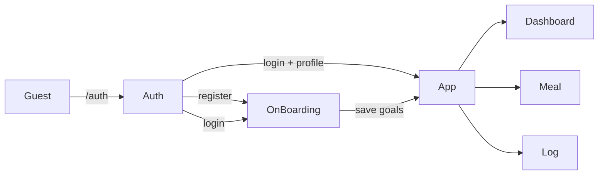

# Nutrition

Pet-проект — дневник питания и воды. Без подписок и без бэкенда: всё живёт в браузере.

<!-- **Demo:** https://your-app.vercel.app -->

## Что умеет

- регистрация / вход, protected routes (нет сессии → auth, нет профиля → onboarding)
- onboarding: пол, рост, вес, цель, активность → расчёт дневных норм (Mifflin–St Jeor) и сохранение в БД
- dashboard: калории, БЖУ, вода, progress bars
- дневник по приёмам пищи (завтрак / обед / ужин / перекус)
- добавление еды из каталога или своего продукта (БЖУ на 100 г, хранится в IndexedDB)
- граммовка с пересчётом калорий и макросов на лету
- учёт воды с быстрым выбором объёма

## Стек

React 19 · TypeScript · Vite · React Router 7 · Dexie 4 · Tailwind CSS 4 · Lucide

## Как устроено

```
screens/          — страницы (Auth, OnBoarding, Dashboard, Meal, Log)
components/
  routing/        — GuestRoute, OnBoardingRoute, ProtectedRoute
  features/meal/  — GramStepper, MacroGrid
repositories/     — тонкий слой над Dexie (users, meals, water, onboarding, customProducts)
utils/            — currentUser, nutritionGoals, scaleNutrition, dateRange
db/db.ts          — схема и миграции Dexie (v2: цели в профиле + customProducts)
```

**Сессия:** `userId` в `localStorage`, без fallback на дефолтного пользователя.

**Нормы:** при создании профиля считаются один раз и пишутся в `OnBoarding`. Dashboard читает сохранённые значения; для старых записей без полей — fallback на пересчёт.

**Еда:** каталог (`consts/dishes.ts`) + пользовательские продукты. При добавлении в дневник в `meals` попадают уже масштабированные значения под выбранную граммовку.



## Запуск

```bash
bun install   # или npm install
bun dev       # http://localhost:5173
```

Сборка и линт:

```bash
bun run build
bun run lint
```

## Ограничения (осознанно для pet)

- пароли в IndexedDB как plain text — не production auth
- нет синка между устройствами: данные только в этом браузере
- нет серверной валидации и восстановления пароля

## Ветки

- `main` — стабильная
- `development` — текущая разработка (UI + БД)

## Автор

Timur Abutalipov — pet-проект для портфолио.
